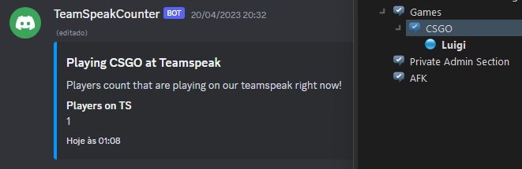

# Teamspeak 3 channel counter

This is a simple app that counts how many users are in a specific teamspeak channel and updates automatically in a discord channel, in a embed message. I made this because my friends and I are migrating from Discord to Teamspeak for playing CSGO, because TS is a lightweight app compared to Discord, so this bot facilitates who are more used to check discord to see who is playing.



## Building

I use pnpm for building, you can install [pnpm here](https://pnpm.io/installation), after that you can install dependencies and transpile the project using: 

```console
pnpm install
pnpm run build
```

## Setup environment variables
Just rename .env.example to .env - This project uses [dotenv for handling environment variables in file](https://github.com/motdotla/dotenv). You can always use define the environment variable in your preferred way.

## Running
You can run in development mode using

```console
pnpm run dev
```
You can run in prod mode using

```console
pnpm run prod
```

## Docker
This project supports docker, for quick run you can check docker-compose.yml file and run with: 

```console
docker compose up
```

Or build directly with:

```console
docker build -t ts3-bot-discord .
```

And run with:

```console
docker run --env-file .env ts3-bot-discord
```

You do not need to expose any port.